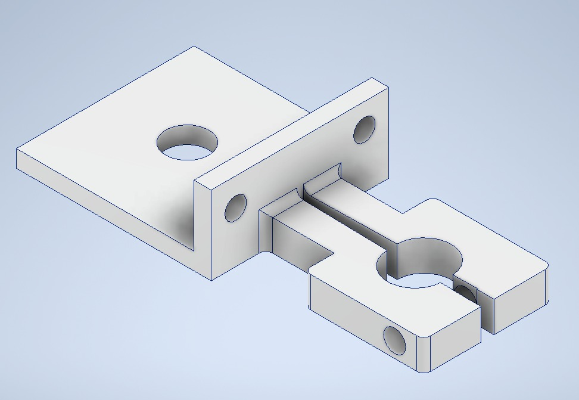
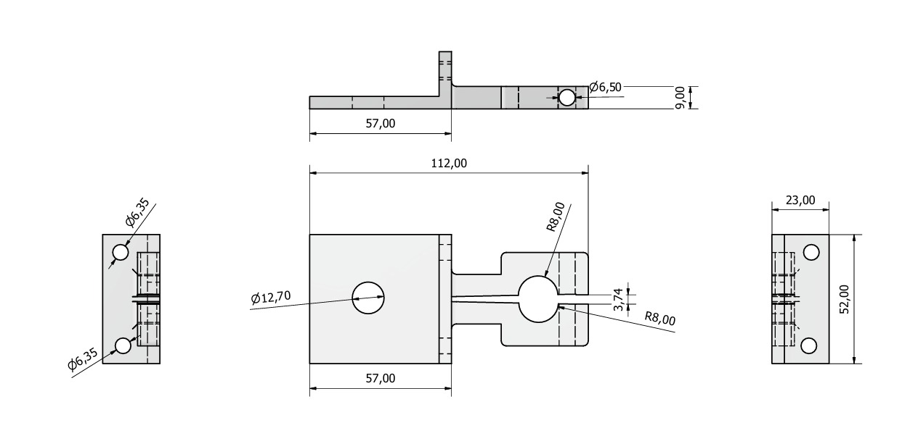
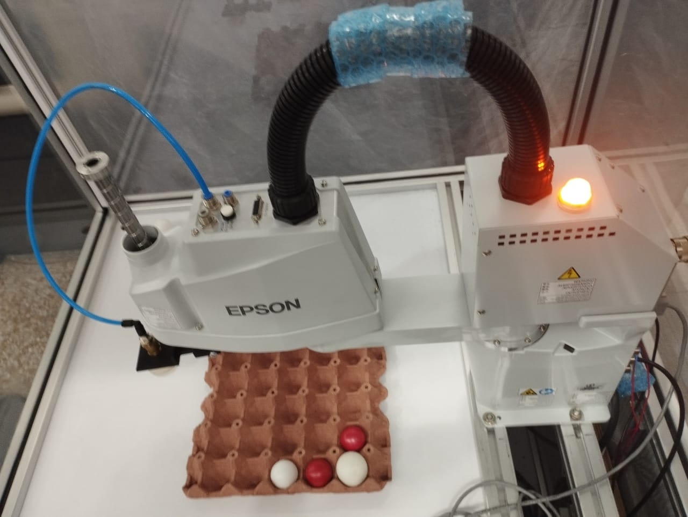
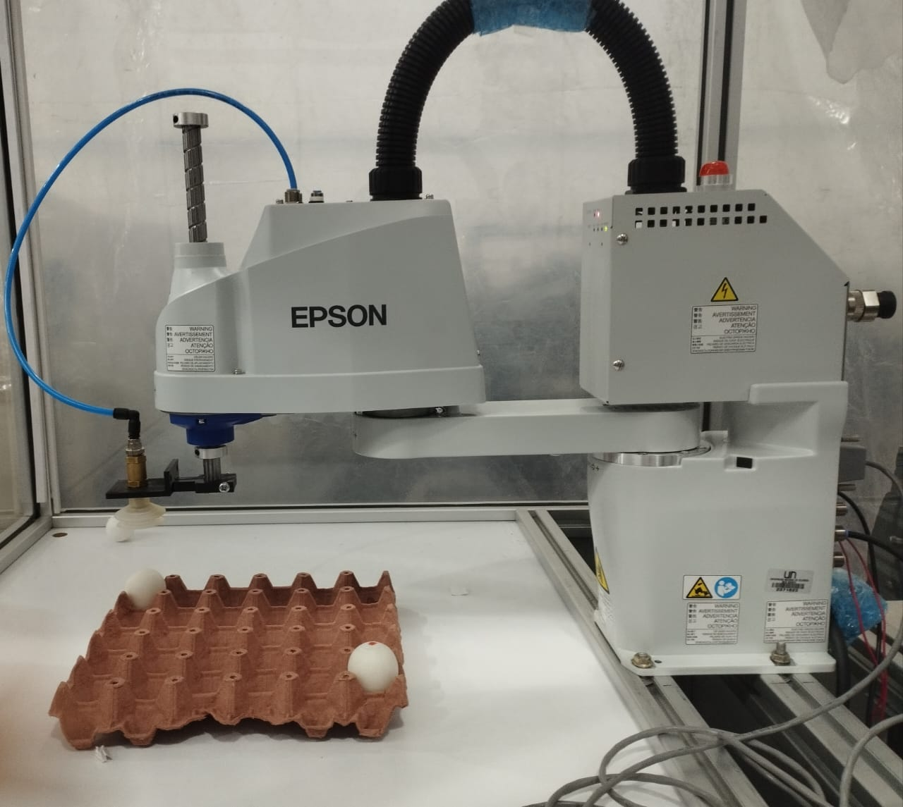
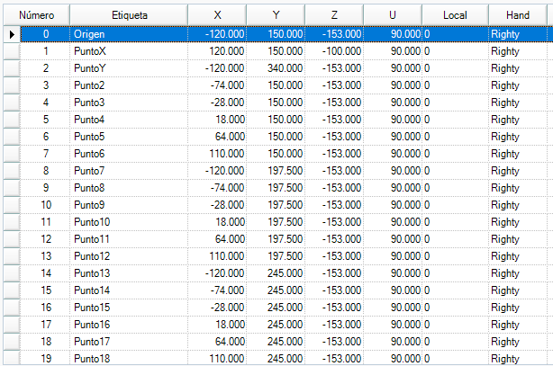
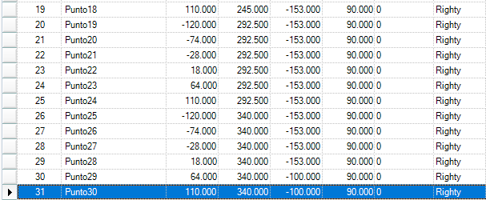

# Informe Laboratorio No. 03 - Análisis y Operación del Manipulador EPSON T3-401S

### Autores:  
Esteban Durán Jiménez  
Ana María Orozco Reyes  

**FACULTAD DE INGENIERÍA**  
**ROBÓTICA**  
**2025-II**

---

## Desarrollo experimental

---

## Requerimientos del informe  

### 1. Cuadro comparativo de características técnicas del Motoman MH6, ABB IRB 140 y EPSON T3-401S

| Característica                 | Motoman MH6                         | ABB IRB 140                         | EPSON T3-401S                      |
|--------------------------------|-------------------------------------|-------------------------------------|------------------------------------|
| Tipo de robot                  | Articulado                          | Articulado                          | SCARA                              |
| Grados de libertad             | 6                                   | 6                                   | 4                                  |
| Carga útil máx.                | 6 kg                                | 6 kg                                | 3 kg                               |
| Alcance aprox.                 | 1422 mm                             | 810 mm (hasta eje 5)                | 400 mm (radio de trabajo)          |
| Repetibilidad                  | ±0,08 mm                            | ±0,03 mm                            | ±0,02 mm                           |
| Masa del robot                 | ~130 kg                             | ~98 kg                              | ~16 kg                             |
| Montaje típico                 | Piso, pared, techo                  | Piso, invertido o pared             | Mesa / celda compacta              |
| Aplicaciones típicas           | Soldadura, manipulación, dispensado | Manipulación, empaquetado, soldadura| Ensamble, pick & place, inspección |

### Anlisis de robots:

Los tres robots evaluados presentan enfoques claramente diferenciados en función de su arquitectura mecánica, sus capacidades cinemáticas y el tipo de aplicación al que están orientados. El Motoman MH6 y el ABB IRB 140 corresponden a robots articulados de seis grados de libertad, lo que les confiere una elevada flexibilidad espacial y la posibilidad de ejecutar trayectorias complejas en entornos tridimensionales. Esto los hace especialmente adecuados para operaciones que requieren cambios de orientación continuos y acceso a múltiples planos de trabajo, como soldadura, manipulación de piezas y procesos de ensamblaje más exigentes. Entre ambos, el ABB IRB 140 destaca por su mayor repetibilidad y menor masa, lo que se traduce en mayor precisión y eficiencia en celdas compactas, mientras que el Motoman MH6 ofrece un mayor alcance, favoreciendo aplicaciones que requieren cubrir áreas de trabajo más amplias.

En contraste, el EPSON T3-401S, al ser un robot tipo SCARA con cuatro grados de libertad, está optimizado para movimientos planos rápidos y altamente repetitivos. Su diseño prioriza la velocidad y la precisión en tareas de corto alcance, como el pick & place y el ensamblaje ligero, donde la repetibilidad y los tiempos de ciclo resultan críticos. Si bien presenta limitaciones en comparación con los robots articulados en términos de flexibilidad espacial y capacidad de carga, su desempeño es superior en aplicaciones de alta cadencia dentro de celdas compactas. En conjunto, la comparación evidencia cómo cada robot responde a necesidades industriales específicas, reafirmando que la selección óptima depende del equilibrio requerido entre alcance, precisión, velocidad y complejidad de movimiento.

---
### 2. Diferencias entre los tipos de trayectorias en EPSON RC+ 7.0

El software **EPSON RC+ 7.0** ofrece distintos tipos de trayectorias que determinan cómo el robot interpola su movimiento entre puntos programados. Estas trayectorias influyen directamente en la precisión geométrica, la velocidad de ejecución, la seguridad operacional y el comportamiento dinámico del robot durante su desplazamiento.

### Cuadro comparativo de tipos de trayectoria

| Tipo de trayectoria | Comando en EPSON RC+ | Descripción | Control del recorrido | Ventajas | Desventajas | Aplicaciones típicas |
|--------------------|------------------------|-------------|------------------------|----------|-------------|----------------------|
| **Articulada (Joint)** | `Move` | El robot se desplaza optimizando el movimiento de sus ejes articulares, sin garantizar que el efector final siga una línea recta en el espacio. | Bajo control cartesiano, alto control articular | Mayor velocidad y eficiencia, menor tiempo de ciclo | Trayectoria impredecible en el espacio | Movimientos generales entre puntos, transferencia rápida |
| **Lineal** | `MoveL` | El efector final se desplaza siguiendo una línea recta en el espacio cartesiano entre dos puntos. | Alto control geométrico | Mayor precisión espacial y predictibilidad | Menor velocidad, mayor carga computacional | Soldadura, ensamblaje, inserción de piezas |
| **Circular / Arco** | `Arc` | Movimiento curvo definido por un punto intermedio y un punto final, generando un arco controlado. | Control geométrico curvo | Trayectorias suaves y continuas | Programación más compleja | Trazado de contornos, procesos curvos |
| **Salto** | `Jump` | Movimiento que combina desplazamiento horizontal con elevación automática en Z para evitar colisiones. | Control limitado del camino | Reduce riesgo de choque, rápido | No mantiene trayectoria precisa | Pick & place, paletizado |
| **Directo** | `Go` | Movimiento simple hacia un punto, sin gestión avanzada de trayectoria intermedia. | Muy bajo control | Simplicidad y rapidez | Menor seguridad y control | Posicionamiento básico |

---

### Análisis comparativo

Los distintos tipos de trayectorias disponibles en EPSON RC+ 7.0 permiten adaptar el comportamiento del robot a los requerimientos específicos de cada proceso. La trayectoria **articulada (Move)** prioriza la optimización del movimiento de los ejes, resultando eficiente en términos de tiempo, aunque sacrifica precisión en el camino recorrido por el efector final.

Las trayectorias **lineales (MoveL)** y **circulares (Arc)** proporcionan un control preciso del recorrido espacial, siendo esenciales en procesos donde la geometría de la trayectoria influye directamente en la calidad del resultado, como en soldadura o ensamblaje de precisión.

El movimiento tipo **Jump** se orienta a tareas repetitivas de manipulación, priorizando la seguridad mediante elevación automática para evitar colisiones, mientras que el comando **Go** constituye una opción básica para movimientos rápidos sin requerimientos geométricos estrictos.

En conclusión, la selección del tipo de trayectoria debe realizarse considerando el equilibrio entre velocidad, precisión y seguridad, en función de las exigencias de la aplicación industrial específica.

---

### 3. Descripción de las configuraciones *home* del EPSON T3-401S, indicando la posición de cada articulación

En el laboratorio se utilizó el EPSON T3-401S como robot SCARA de 4 ejes:  
- **J1 (eje de base)**  
- **J2 (eje de brazo)**  
- **J3 (eje Z de desplazamiento vertical)**  
- **J4 / U (rotación del efector final)**  

En EPSON RC+ 7.0 las posiciones *home* se definen como puntos de referencia enseñados (por ejemplo `HOME` o `P_HOME`) y almacenados en la controladora. De forma general:

---
#### HOME de referencia (Home mecánico / seguro)

- J1 ≈ 0° → brazo alineado hacia el frente de la celda.  
- J2 ≈ 0° → eslabones extendidos en línea recta.  
- J3 en posición alta segura (por encima de la cubeta y elementos de la mesa).  
- J4 ≈ 0° → orientación neutra del efector, alineado con el eje X del robot.  

Esta posición se utiliza como punto de **inicio y fin** de la rutina, así como referencia para calibración, comprobación de límites y verificación de condiciones seguras antes de iniciar cualquier movimiento automático.

---

#### HOME de trabajo (home operativo)

Se definió un segundo punto *home* cercano al área de paletizado, con el objetivo de optimizar los tiempos de ciclo y mejorar la eficiencia de los movimientos. Este *home* se configuró de manera estratégica colocando la primera articulación en la mitad aproximada de su rango de movimiento, obteniendo una orientación natural del robot hacia el eje **Y** de la celda de trabajo.

Las posiciones específicas configuradas en EPSON RC+ para este HOME de trabajo fueron:

- **J1 = 204800 pulsos de codificador**  
  Corresponde a una posición intermedia del eje base, orientando el robot directamente hacia la zona frontal de la cubeta, logrando una distribución simétrica del alcance y reduciendo desplazamientos angulares extremos.

- **J2 = 0 pulsos**  
  Mantiene el segundo brazo en una posición neutra, facilitando el acceso al área central de trabajo.

- **J3 = 0 pulsos**  
  Define la altura de referencia desde la cual el robot inicia los movimientos de aproximación vertical.

- **J4 = 0 pulsos**  
  Establece la orientación del efector final alineada con la geometría principal de la cubeta.

Esta configuración genera una postura más equilibrada del SCARA, mejorando la cinemática general del sistema y reduciendo el esfuerzo mecánico durante la ejecución continua de trayectorias tipo paletizado. Además, favorece una transición más fluida entre puntos de trabajo, disminuyendo tiempos muertos y elevando la eficiencia del ciclo operativo.

---

### 4. Procedimiento detallado para realizar movimientos manuales del EPSON T3-401S (articulaciones, cartesianos, traslaciones y rotaciones)

El movimiento manual del T3-401S se realiza principalmente desde el software **EPSON RC+ 7.0**, utilizando el panel **Jog & Teach** o, si está disponible, un *teach pendant* TP2.  

**Pasos generales:**

1. **Encendido y conexión**
   1. Encender el controlador del robot y verificar que no existan alarmas activas.  
   2. Abrir EPSON RC+ 7.0 y cargar el proyecto correspondiente al T3-401S.  
   3. Confirmar que el estado del controlador aparezca como **ONLINE** en el *Robot Manager*.

2. **Habilitar el robot**
   1. Activar el suministro de energía del controlador.  
   2. En el panel *Robot* de EPSON RC+, habilitar el robot (`Motor ON` / `Servo ON`) siguiendo el procedimiento de seguridad de la celda.  

3. **Acceso al panel Jog & Teach**
   1. Abrir la pestaña **Jog & Teach**.  
   2. Seleccionar el robot T3-401S si hay más de un manipulador en la celda.

4. **Selección del modo de movimiento**
   En la sección **Jog Mode** se selecciona el sistema de coordenadas:  
   - **Joint** → movimiento por articulaciones (J1, J2, Z, U).  
   - **World / Base** → movimiento cartesiano respecto al sistema de base.  
   - **Tool** → movimiento cartesiano respecto a la herramienta (TCP).  
   - **Local / User** → sistemas definidos por el usuario (por ejemplo, sistema de la cubeta).

5. **Movimiento por articulaciones**
   - Con el modo **Joint** activo:  
     - Usar los botones `+J1 / -J1`, `+J2 / -J2`, `+Z / -Z`, `+U / -U` del panel para mover cada eje.  
     - Mantener pulsado el botón de jogging mientras se desea el movimiento (o el botón físico de habilitación en el teach pendant, si aplica).  
     - Verificar en la ventana de estado los ángulos y posición actual del robot.

6. **Movimiento cartesiano (traslaciones y rotaciones)**
   - Con el modo **World** o **Tool** activo:  
     - Traslaciones:
       - `+X / -X` → desplazamiento en eje X.  
       - `+Y / -Y` → desplazamiento en eje Y.  
       - `+Z / -Z` → subida / bajada del eje vertical.  
     - Rotaciones:
       - `+Rx / -Rx`, `+Ry / -Ry`, `+Rz / -Rz` → rotaciones alrededor de los ejes cartesianos, afectando la orientación de la herramienta (en el T3 principalmente `Rz` / `U`).  
   - El movimiento puede ser **continuo** o por **pasos discretos**, según la distancia seleccionada en *Jog Distance*.

7. **Registro de puntos (Teach)**
   - Una vez alcanzada una posición deseada (por ejemplo, una esquina de la cubeta), se utiliza el botón **Teach** del panel para guardar el punto en la lista de posiciones del proyecto, asignándole un nombre significativo (`P_HOME`, `P_HUEVO_1`, etc.).  

8. **Finalización**
   - Llevar el robot nuevamente a *home* o a una posición segura.  
   - Deshabilitar motores si no se va a seguir operando (`Motor OFF`).  
   - Guardar el proyecto antes de cerrar EPSON RC+.

---

## 4. Procedimiento detallado para movimientos manuales del EPSON T3-401S  
*(articulaciones, cartesianos, traslaciones y rotaciones)*

El movimiento manual del robot SCARA **EPSON T3-401S** se realiza desde el entorno **EPSON RC+ 7.0**, mediante el panel **Jog & Teach** o el panel de control físico cuando se habilita el modo de liberación de frenos en condiciones específicas.

### 4.1 Condiciones previas
1. Encender el controlador del manipulador y verificar ausencia de alarmas.
2. Conectar EPSON RC+ con el controlador y confirmar estado **ONLINE**.
3. Activar servomotores desde *Tools → Robot Manager → Control Panel*.
4. Confirmar que el manipulador se encuentre fuera de colisiones.

### 4.2 Modos de movimiento manual

En el panel **Jog & Teach** se habilitan los siguientes sistemas de referencia:

| Modo | Descripción técnica |
|------|----------------------|
| Joint | Control individual de articulaciones J1, J2, J3 (Z) y J4 (U). |
| World/Base | Movimiento cartesiano respecto al sistema de coordenadas base. |
| Tool | Movimiento cartesiano respecto al TCP de la herramienta. |
| User/Local | Sistema definido por el usuario, útil para marcos de trabajo como la cubeta. |

### 4.3 Movimiento por articulaciones
En modo **Joint**, se manipulan directamente los ejes:
- J1 y J2: rotacionales horizontales.
- J3: desplazamiento vertical (requiere liberación de freno si es manual).
- J4: rotación del efector final.

Durante movimientos sin servo, la articulación 3 requiere presionar el interruptor de desbloqueo de freno para permitir desplazamiento vertical seguro .

### 4.4 Movimiento cartesiano
En modos **World** y **Tool** se habilitan:
- Traslaciones lineales: +X, -X, +Y, -Y, +Z, -Z.
- Rotaciones: Rx, Ry y principalmente Rz (equivalente a eje U en SCARA).

El tipo de movimiento puede ser PTP o CP, dependiendo si el robot interpola punto a punto o trayectoria continua, respectivamente .

---

### 5. Explicación de los niveles de velocidad para movimientos manuales, cambio entre niveles e identificación en la interfaz

En el EPSON T3-401S, operado mediante **EPSON RC+ 7.0**, la velocidad de los movimientos manuales (jogging) se controla desde el panel **Mover y enseñar (Jog & Teach)** a través del parámetro **Velocidad**, el cual dispone exclusivamente de **dos niveles predefinidos**:

- **Baja**
- **Alta**

Estos niveles se seleccionan mediante un menú desplegable visible en la interfaz, tal como se muestra en el teach pendant virtual del software.

---

#### a) Niveles de velocidad disponibles

| Nivel de velocidad | Descripción técnica | Uso recomendado |
|--------------------|----------------------|-----------------|
| **Baja** | Movimiento lento y controlado, con alta precisión y respuesta progresiva. | Enseñanza de puntos, aproximaciones finas, trabajo cercano a piezas u obstáculos. |
| **Alta** | Movimiento rápido dentro del rango seguro definido por el sistema. | Desplazamientos amplios, retorno a HOME y reposicionamientos generales. |

Estos niveles están definidos internamente por el controlador del robot y no pueden subdividirse en más escalones desde la interfaz estándar del usuario.

---

#### b) Cambio entre niveles

El operador puede alternar entre **Baja** y **Alta** directamente desde el panel *Mover y enseñar*:

1. Ubicar el menú desplegable **Velocidad**.
2. Seleccionar el nivel deseado:
   - `Baja` para movimientos precisos.
   - `Alta` para movimientos rápidos.
3. El cambio se aplica de inmediato al presionar cualquier botón de jogging (+X, -Y, +Z, etc.).

Este selector actúa únicamente sobre los movimientos manuales y no altera las velocidades programadas dentro del código SPEL+.

---

#### c) Relación con la distancia de movimiento

El comportamiento del jog se complementa además con la opción **Distancia de movimiento**, que permite seleccionar:

- **Continuo**
- **Largo**
- **Medio**
- **Corto**

La combinación de:
- Nivel de velocidad (Baja / Alta)  
- Tipo de distancia (Continuo / Largo / Medio / Corto)

permite un control preciso del desplazamiento manual sin necesidad de múltiples escalones de velocidad.

---

#### d) Identificación en la interfaz

El nivel activo de velocidad se visualiza claramente en el panel mediante el texto:

- `Velocidad: Baja`  
- `Velocidad: Alta`

Este indicador se mantiene visible en todo momento, evitando ambigüedad para el operador durante la enseñanza de puntos o movimientos de posicionamiento.

---

#### e) Recomendaciones de seguridad

- Utilizar siempre **velocidad Baja** al enseñar puntos dentro de la cubeta o cerca de personas.  
- Usar **velocidad Alta** únicamente en trayectorias despejadas y verificadas.  
- Cambiar a Baja antes de realizar ajustes finos o correcciones de posición.

En conclusión, el sistema de jogging del EPSON T3-401S prioriza la simplicidad y la seguridad operativa al limitar los niveles de velocidad manual a dos estados claramente definidos, facilitando la toma de decisiones del operador y reduciendo riesgos durante la enseñanza.

---

## 6. Funcionalidades principales de EPSON RC+ 7.0 y su comunicación con el manipulador

### 6.1 EPSON RC+ 7.0

EPSON RC+ 7.0 constituye el entorno integral de desarrollo, configuración y operación para los robots industriales EPSON, incluyendo el modelo T3-401S. Este software no solo actúa como plataforma de programación, sino también como interfaz directa entre el operador y el controlador del manipulador, permitiendo el control completo del ciclo de vida de la aplicación robótica.

---

### 6.1.1 Entorno de programación y control SPEL+

EPSON RC+ integra el lenguaje nativo **SPEL+**, descrito en la documentación como un lenguaje multitarea orientado específicamente al control de robots industriales. Este entorno permite:

- Programación estructurada de rutinas robóticas con control de tareas paralelas.
- Ejecución en modo paso a paso y depuración con monitoreo de variables.
- Control simultáneo de hasta 4 articulaciones mediante servocontrol digital de CA.
- Implementación de movimientos PTP (punto a punto) y CP (trayectoria continua). 

Los perfiles de velocidad y aceleración pueden ser programados en rangos configurables entre 1 y 100 %, y para movimientos continuos en valores reales definidos manualmente por el usuario. 

---

### 6.1.2 Panel Jog & Teach y control manual

Desde EPSON RC+ se accede al panel gráfico **Jog & Teach**, que permite:

- Movimiento manual por articulaciones o coordenadas cartesianas.
- Enseñanza y registro de posiciones mediante función Teach.
- Visualización en tiempo real de posición, orientación y estado del brazo.
- Control de velocidad de jogging con niveles predefinidos.

Este panel actúa como un teach pendant virtual completo, facilitando operaciones de ajuste fino, calibración y enseñanza segura.

---

### 6.1.3 Gestión de entradas y salidas (E/S)

El sistema RC+ permite una integración avanzada con dispositivos externos mediante E/S estándar y remotas:

- **Entradas:** 18 puntos estándar.
- **Salidas:** 12 puntos estándar.
- Capacidad de control remoto para funciones como Start, Stop, Reset y Pause.
- Señales de estado como Ready, Running, Error y SafeguardOn. 

Estas señales permiten sincronizar el movimiento del robot con sistemas neumáticos, sensores, válvulas y PLCs, generando un sistema automatizado completo.

---

### 6.1.4 Control y monitoreo de alarmas

EPSON RC+ ofrece un módulo específico para la gestión y monitoreo de alarmas del manipulador, accesible desde el menú:

Tools → Maintenance → Controller Tools

Desde este módulo se puede:

- Supervisar el estado de desgaste de partes críticas.
- Programar alarmas relacionadas con vida útil de componentes.
- Visualizar advertencias cuando se alcanza el límite operativo de piezas. 

Además, las alarmas no pueden ser eliminadas simplemente reiniciando el controlador, siendo necesario un procedimiento específico desde el panel de mantenimiento para su cancelación. 

---

### 6.1.5 Función de copia de seguridad y restauración

EPSON RC+ incorpora la función **Backup Controller**, que permite:

- Almacenar la configuración completa del controlador.
- Respaldar parámetros del manipulador, programas y ajustes de sistema.
- Restaurar configuraciones en casos de fallos o reemplazo de hardware. 

Esta función resulta crítica para garantizar la continuidad operativa y la protección de la configuración ante eventos inesperados.

---

### 6.1.6 Configuración del sistema remoto

El software permite configurar parámetros avanzados de control remoto:

- Control de condiciones como MotorsOn, PowerHigh, AtHome.
- Selección de condiciones mediante señales SelRobot.
- Monitoreo de estado persistente hasta reinicio del controlador. 

Esto habilita integraciones complejas con sistemas externos de automatización industrial.

---

## 6.2 Comunicación entre EPSON RC+ 7.0 y el manipulador

La comunicación entre el PC y el controlador del T3-401S se realiza mediante conexión física (USB o Ethernet), estableciendo una interfaz bidireccional que permite:

1. Transferencia y compilación de programas SPEL+.
2. Envío de comandos operativos: Start, Stop, Reset.
3. Supervisión en tiempo real de estados, alarmas y variables.
4. Recepción de señales de sensores externos.
5. Control preciso de perfiles de velocidad, aceleración y movimiento.

Una vez compilado el programa, este es ejecutado por el controlador interno, el cual se encarga de:

- Interpolación de trayectorias PTP y CP.
- Gestión del servocontrol de cada eje.
- Monitoreo de límites articulares y protección de seguridad.

---

### Síntesis técnica

EPSON RC+ 7.0 no se limita a ser un entorno de programación, sino que constituye una plataforma completa de supervisión, control, diagnóstico, mantenimiento y respaldo del sistema robótico. Su integración directa con el controlador del T3-401S permite una coordinación precisa entre software y hardware, asegurando eficiencia operativa, alta confiabilidad y trazabilidad del estado del sistema en tiempo real.

---

## 7. Análisis comparativo: EPSON RC+ 7.0 vs RoboDK vs RobotStudio

| Característica | EPSON RC+ 7.0 | RoboDK | RobotStudio |
|----------------|---------------|--------|-------------|
| Fabricante | EPSON | Multimarca | ABB |
| Tipo de herramienta | Control directo + simulación básica | Simulación y programación offline | Simulación avanzada con controlador virtual |
| Lenguaje principal | SPEL+ | Python | RAPID |
| Relación con el hardware | Directa con controlador EPSON | Indirecta (exportación de código) | Directa mediante Virtual Controller |
| Nivel de fidelidad respecto al robot real | Medio | Variable según post-procesador | Muy alto |
| Enfoque | Operación y control en tiempo real | Integración y planificación multimarca | Programación y validación precisa ABB |

---

### EPSON RC+ 7.0

EPSON RC+ 7.0 es el entorno oficial para configuración, programación y operación de robots EPSON, como el T3-401S. Está diseñado para trabajar de forma estrechamente integrada con el controlador físico, permitiendo no solo la edición y compilación de programas en lenguaje **SPEL+**, sino también la ejecución directa y monitoreo en tiempo real del manipulador.  

Desde este entorno se realizan tareas críticas como:
- Configuración de rangos de movimiento por pulsos y límites articulares.
- Parametrización de peso e inercia del efector final.
- Definición de modos de operación (AUTO, PROGRAM) y control del estado del robot.
- Gestión de comunicación por USB o Ethernet, incluyendo carga y transferencia de programas, así como monitoreo de estados y alarmas del sistema.

La principal fortaleza de EPSON RC+ radica en su enfoque hacia la implementación física real: el usuario enseña puntos, prueba trayectorias y ejecuta rutinas directamente sobre el robot, como en el caso del recorrido tipo caballo sobre la cubeta de huevos. Su simulación es funcional pero está orientada más al soporte de ejecución que a una recreación física compleja del entorno. 

---

### RoboDK

RoboDK se posiciona como una plataforma de simulación y programación offline de carácter multimarca. A diferencia de EPSON RC+, no está ligada a un fabricante específico, sino que ofrece una biblioteca extensa de robots industriales y permite modelar celdas completas sin necesidad de acceso físico al manipulador.

Sus capacidades incluyen:
- Creación de estaciones virtuales con múltiples robots de diferentes marcas.
- Simulación geométrica de trayectorias y verificación de alcances.
- Generación automática de código en el lenguaje nativo de cada robot mediante post-procesadores.
- Integración con CAD y planificación de procesos.

RoboDK resulta especialmente útil en entornos académicos y de diseño conceptual, donde se requiere estudiar comparativamente el comportamiento de varios robots antes de definir la plataforma final. Sin embargo, su nivel de fidelidad depende del post-procesador y no replica completamente la lógica interna del controlador físico.

---

### RobotStudio (ABB)

RobotStudio es la suite oficial de ABB para modelado, simulación y programación de robots industriales. Su característica más distintiva es la incorporación del **Virtual Controller**, que replica el software del controlador real, permitiendo que los programas RAPID se ejecuten en un entorno virtual con un comportamiento prácticamente idéntico al sistema físico.

Entre sus funcionalidades avanzadas se destacan:
- Creación de estaciones virtuales completas con robots, posicionadores y ejes externos.
- Programación gráfica en entorno 3D y generación automática de código RAPID.
- Detección y evitación de colisiones.
- Simulación de señales de E/S y lógica de proceso.
- Integración de componentes inteligentes y simulación física avanzada.
- Puesta en servicio virtual antes de la implementación real.

RobotStudio permite validar trayectorias y tiempos de ciclo con alta precisión, facilitando la optimización y reducción de riesgos antes de llevar el programa al robot físico. Este enfoque lo hace ideal para aplicaciones industriales donde se requiere máxima exactitud y coherencia con el comportamiento real del controlador ABB. 

---

### Comparación técnica integrada

- **EPSON RC+ 7.0** está orientado al control operativo directo del robot EPSON, facilitando la programación, monitoreo y ejecución en tiempo real, con simulación funcional pero limitada en complejidad física.  
- **RoboDK** actúa como un entorno neutral para diseño, análisis y comparación multimarca, ideal para planificación y enseñanza, aunque con menor realismo dinámico frente al hardware.  
- **RobotStudio** ofrece el mayor nivel de fidelidad gracias al Virtual Controller, permitiendo validar programas y trayectorias con una representación casi exacta del comportamiento del robot ABB real.

---

### Aplicación en el laboratorio

En el contexto del laboratorio:
- **EPSON RC+ 7.0** fue utilizado para la implementación real del movimiento tipo caballo sobre la cubeta en el T3-401S, incluyendo enseñanza de puntos y ejecución directa.  
- **RoboDK** sirvió como entorno conceptual de comparación para analizar posibles trayectorias y configuraciones en distintos robots.  
- **RobotStudio** se empleó como referencia técnica avanzada para comprender los procesos de simulación de alta fidelidad aplicables al ABB IRB 140, especialmente en términos de validación previa y análisis de colisiones.

Esta combinación permitió evaluar no solo el desempeño físico del robot EPSON, sino también las diferencias entre ecosistemas de programación industrial y simulación robótica profesional.

---

### 8. Diseño técnico del gripper neumático por vacío

  
   
  <em>Isométrico del diseño del gripper.</em>

  
   
  <em>Plano del diseño del gripper.</em>

### Descripción del diseño mecánico del gripper

El elemento mostrado en las Figuras 1 y 2 corresponde al **soporte mecánico del gripper** que conecta el acople metálico del eje del EPSON T3-401S con la ventosa utilizada para la manipulación de los huevos (Figura 3). El diseño integra en una sola pieza:

1. **Placa de sujeción al eje del robot**  
2. **Brazo de transmisión**  
3. **Zona de sujeción al acople cilíndrico**  
4. **Superficie de montaje de la ventosa y los elementos neumáticos**

De este modo se garantiza una alineación geométrica controlada entre el eje del robot, el acople metálico y la ventosa, manteniendo la rigidez necesaria y evitando interferencias con la cubeta de huevos.

---

### Elementos principales del diseño

1. **Placa superior de montaje (57 × 57 mm, espesor 9 mm)**  
   - Contiene un taladro central de Ø12,7 mm que sirve como **punto de fijación para la ventosa** o para el conjunto portaventosa.  
   - La superficie plana proporciona una base estable para atornillar el cuerpo de latón del eyector/válvula neumática, tal como se aprecia en el montaje real.  
   - Esta placa define el **plano de trabajo del TCP**, dejando la ventosa por debajo y centrada respecto al patrón de la cubeta.

2. **Ala vertical o escuadra (52 × 23 mm)**  
   - Genera una configuración tipo **“L” rígida**, incrementando el momento de inercia de la sección y reduciendo la flexión del brazo cuando la ventosa hace contacto con el huevo.  
   - Incorpora dos taladros pasantes de Ø6,35 mm que permiten el **atornillado al acople metálico** del eje del robot, garantizando una unión firme y repetible.  
   - Esta escuadra también facilita absorber pequeños desalineamientos entre el eje del robot y el plano de la ventosa sin comprometer la rigidez global.

3. **Brazo intermedio (longitud total 112 mm)**  
   - Une la zona de sujeción al acople con la zona de la ventosa, generando el **desplazamiento necesario para que la ventosa alcance la cubeta de huevos** sin que el cuerpo del robot interfiera.  
   - Su sección mantiene el mismo espesor que la placa (9 mm), lo que ofrece un compromiso adecuado entre rigidez y masa reducida, particularmente importante para no penalizar la dinámica del T3-401S.

4. **Zona de acople al eje/abrazadera (R8, ranura y taladro Ø6,5 mm)**  
   - La parte frontal presenta un alojamiento circular de **radio 8 mm** con una ranura longitudinal que permite **funcionar como abrazadera** sobre el acople cilíndrico metálico.  
   - El taladro transversal Ø6,5 mm, combinado con la ranura, permite que un tornillo de apriete genere una **pre-carga radial**, sujetando el acople sin necesidad de mecanizados complejos ni chavetas.  
   - Esta solución facilita el **montaje y desmontaje rápido** del gripper y permite pequeños ajustes angulares para alinear la ventosa con la cubeta.

---

### Justificación del diseño

- **Compatibilidad geométrica con el acople metálico y la ventosa**  
  La combinación de la abrazadera cilíndrica en un extremo y la placa plana con taladro central en el otro permite una **transición directa entre el eje del robot y la ventosa**, minimizando tolerancias acumuladas y asegurando que el centro de la ventosa quede bien definido respecto al sistema de coordenadas herramienta.

- **Rigidez con bajo peso**  
  El uso de una escuadra y un brazo relativamente corto, con espesor constante de 9 mm, proporciona **suficiente rigidez frente a flexión y torsión**, evitando desplazamientos apreciables del TCP durante el contacto con los huevos, al tiempo que mantiene una masa adecuada para no afectar significativamente la capacidad de aceleración del SCARA.

- **Evitar interferencias con la cubeta y el entorno**  
  La longitud del brazo (112 mm) y la posición relativa de la placa permiten que la ventosa trabaje **por delante del acople y de la carcasa del robot**, reduciendo el riesgo de colisión con la cubeta de huevos y con las paredes de la celda de trabajo.

- **Facilidad de fabricación y montaje**  
  La pieza se basa en **volúmenes prismáticos simples** y taladros estándar, lo que la hace apta para impresión 3D o mecanizado básico. El uso de tornillería comercial (M6 aproximado para Ø6,35–6,5 mm) simplifica la integración con los componentes neumáticos y el acople metálico.

- **Flexibilidad para ajustes y mantenimiento**  
  El sistema de abrazadera permite desmontar el gripper sin intervenir el acople ni el eje del robot, facilitando el reemplazo de la ventosa o la modificación del diseño para otras tareas (por ejemplo, cambio de diámetro de ventosa o adaptación a otras piezas).

En conjunto, el diseño mecánico del gripper responde a los requerimientos de **alineación precisa, rigidez, alcance adecuado y facilidad de montaje**, garantizando una manipulación confiable de los huevos en la celda de paletizado con el EPSON T3-401S.

---

### 9. Diagrama de flujo de la rutina de movimiento de huevos (patrón de caballo)

---

### 10. Plano de planta de la cubeta de huevos y posiciones iniciales

  

<em>Plano de planta</em>

  

<em>Posición inicial</em>

  

<em>Plano de planta simulación</em>

  

<em>Plano de planta simulación</em>

Las posiciones iniciales mostradas anteriormente se eligieron teniendo en cuenta los límites de movimiento del robot, de manera que no resultaran errores al realizar la operación en físico. Esta selección consideró tanto el alcance máximo de cada articulación como las posibles interferencias con el entorno o con otros elementos de la máquina. De esta manera, se asegura que el robot pueda ejecutar la secuencia de movimientos planificada de forma precisa y confiable, reduciendo riesgos durante la puesta en marcha.

  

  

<em>Puntos usados en la implementación</em>

---

### 11.Descripción del programa de paletizado intercalado en SPEL+

El fragmento de código presentado está escrito en **SPEL+**, lenguaje propio del entorno EPSON RC+, y tiene como objetivo ejecutar una rutina de **paletizado intercalado de dos huevos** sobre una cubeta, utilizando el robot EPSON T3. Para ello se definen dos trayectorias tipo “caballo de ajedrez”: una asociada al huevo 1 (secuencia P1) y otra al huevo 2 (secuencia P2.2). El movimiento del robot alterna de manera sistemática entre ambas secuencias, garantizando que se visiten todas las posiciones de la cubeta sin repeticiones.

En la parte superior del programa se declara una variable global entera (`Global Integer i`), reservada para futuros usos, y se define la función `main`, que actúa como punto de entrada del ciclo de paletizado. En `main` se realiza la **inicialización del manipulador**: se activan los motores (`Motor On`), se selecciona potencia alta (`Power High`), se fijan aceleración y velocidad al 100 % (`Accel 100, 100` y `Speed 100`) y se lleva el robot a la posición de referencia (`Home`). A continuación, se activa la salida digital `Out_9`, que controla el gripper de vacío, y se invoca la función `Paletizado_01`, donde se encuentra la lógica de la trayectoria.

La función `Paletizado_01` comienza documentando, en forma de comentarios, los **pares de puntos** que definen cada salto de las trayectorias P2.2 y P1. Cada par `(A,B)` representa un movimiento desde la posición A hasta la posición B siguiendo el patrón de un caballo de ajedrez sobre la matriz de la cubeta. Estos puntos corresponden a posiciones previamente enseñadas en EPSON RC+ (por ejemplo, `Punto3`, `Punto17`, `Punto30`, etc.) y se referencian en el código mediante instrucciones de movimiento tipo `Jump`, que realizan desplazamientos rápidos punto a punto sin imponer una trayectoria cartesiana específica.

La estructura interna de `Paletizado_01` está organizada en 37 bloques numerados (`' --- 1`, `' --- 2`, …, `' --- 37`), cada uno de los cuales implementa **dos movimientos consecutivos**: primero un salto de la trayectoria P2.2 y luego un salto de la trayectoria P1. En cada salto se sigue el mismo esquema: el robot se desplaza al punto de destino del huevo actual (`Jump PuntoA`), desactiva la ventosa para depositar el huevo (`Off Out_9`), se traslada al siguiente punto de origen (`Jump PuntoB`) y vuelve a activar la ventosa para tomar el siguiente huevo (`On Out_9`). De este modo, la salida `Out_9` funciona como señal de toma y liberación, perfectamente sincronizada con el cambio de puntos.

Finalmente, los últimos bloques cierran el recorrido de ambas trayectorias, retornando el huevo 1 al punto `Origen` y el huevo 2 al punto `Punto30`, con lo cual se completa un **ciclo cerrado de paletizado**. El resultado es una secuencia determinista en la cual el robot recorre de forma intercalada todas las posiciones definidas para ambos huevos, manteniendo una lógica clara de activación y desactivación del gripper y respetando la planificación geométrica impuesta por el patrón tipo caballo. Esta implementación explícita, basada en la enumeración de todos los saltos mediante instrucciones `Jump`, facilita el análisis, la depuración y la trazabilidad del proceso dentro del contexto del laboratorio académico.

---

### 12. Video de simulación e implementación física

## Conclusiones

El desarrollo del laboratorio con el robot EPSON T3-401S permitió evidenciar de manera práctica la integración entre diseño mecánico, programación y control en una aplicación real de paletizado utilizando una trayectoria tipo caballo de ajedrez. La implementación del programa en lenguaje SPEL+ demostró que el uso de movimientos tipo `Jump`, junto con la activación y desactivación controlada de la ventosa mediante la salida digital `Out_9`, garantiza una secuencia ordenada, repetible y precisa para la manipulación de huevos, minimizando errores por posicionamiento y reduciendo riesgos de colisión.

La definición explícita de todos los pares de puntos para las trayectorias P1 y P2.2 facilitó la comprensión del patrón geométrico y permitió un control total sobre el recorrido del robot, reforzando la importancia de una planificación detallada en aplicaciones de pick & place. Asimismo, el diseño mecánico del gripper, adaptado al acople metálico y a la ventosa, mostró ser adecuado en términos de rigidez, alineación y compatibilidad con la cubeta, contribuyendo a la estabilidad del proceso y a la correcta sujeción de los huevos.

La comparación entre EPSON RC+ 7.0, RoboDK y RobotStudio evidenció las diferencias conceptuales entre un entorno de control directo y programación en línea (EPSON RC+), una plataforma multimarca de simulación y planificación (RoboDK) y una herramienta de simulación avanzada con controlador virtual (RobotStudio). En particular, EPSON RC+ resultó ser la herramienta más apropiada para la ejecución real del laboratorio, mientras que RobotStudio y RoboDK representan alternativas valiosas para análisis previo, validación y comparación de estrategias de programación.

En conjunto, el laboratorio permitió comprender el flujo completo desde el diseño del efector final hasta la ejecución automatizada de la trayectoria, resaltando la importancia de la coherencia entre diseño mecánico, lógica de programación y configuración del software de control en sistemas robóticos industriales.

---

## Referencias

- EPSON. *Manual técnico del robot SCARA EPSON T3-401S*. Seiko Epson Corporation.  
- EPSON. *EPSON RC+ 7.0 User’s Guide and SPEL+ Programming Manual*. Seiko Epson Corporation.  
- ABB Robotics. *RobotStudio Operator’s Manual*. ABB, 2020.  
- Groover, M. P. *Automation, Production Systems, and Computer-Integrated Manufacturing*. Pearson Education.  
- Craig, J. J. *Introduction to Robotics: Mechanics and Control*. Pearson Education.

